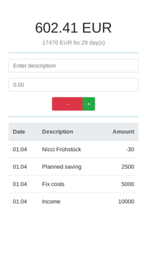

# Overview

A simple budget tracker to keep track of your incoming and outgoing expenses per month as well as statistics about your daily available 
money. Besides a web-frontend which is also usable on a mobile device it provides a comfortable REST API for all your command-line magic.

# Status

All features that I need are implemented. Open an issue if you have the need for an additional feature, or
even better, provide a pull request :-).

In the following we show a screenshot of the current mobile user interface with
fake data (i.e. everything is positive, no expenses, ...).

# Build

Note that you should clone this repository in your `$GOPATH/src/github.com/mlesniak/budget-tracker`. In addition, you should have installed go-bindata, e.g. using

    go get -u github.com/jteeuwen/go-bindata/...

We use `make` to build, hence a 

    make all

should suffice. To generate docker images for two instances proxied by nginx, use

    make docker

to generate the docker images budget/nginx and budget/core. Adapt default.conf to provide
more instances.

# Technologies

We use

- Backend: Go(lang)
- Frontend: Vuejs + Bootstrap

Note that currently no particular frontend packaging system is used, e.g. nothing like webpack and co.

# Guiding Principles

I will be guided by the following principles

- Open Source everything
- Be open to suggestions
- Write idiomatic go code
- Be pragmatic about testing, but try to test everything
- Do not over-engineer

# HTTPS Support

Since the cookie is (currently) submitted in plaintext, at least a HTTPS connection is mandatory. To
generate the necessary server key, use

    openssl genrsa -out server.key 2048

To generate the corresponding certificate, use

    openssl req -new -x509 -sha256 -key server.key -out server.crt -days 3650

## License

The source code is licensed under the [Apache license](https://raw.githubusercontent.com/mlesniak/budget-tracker/master/LICENSE)
